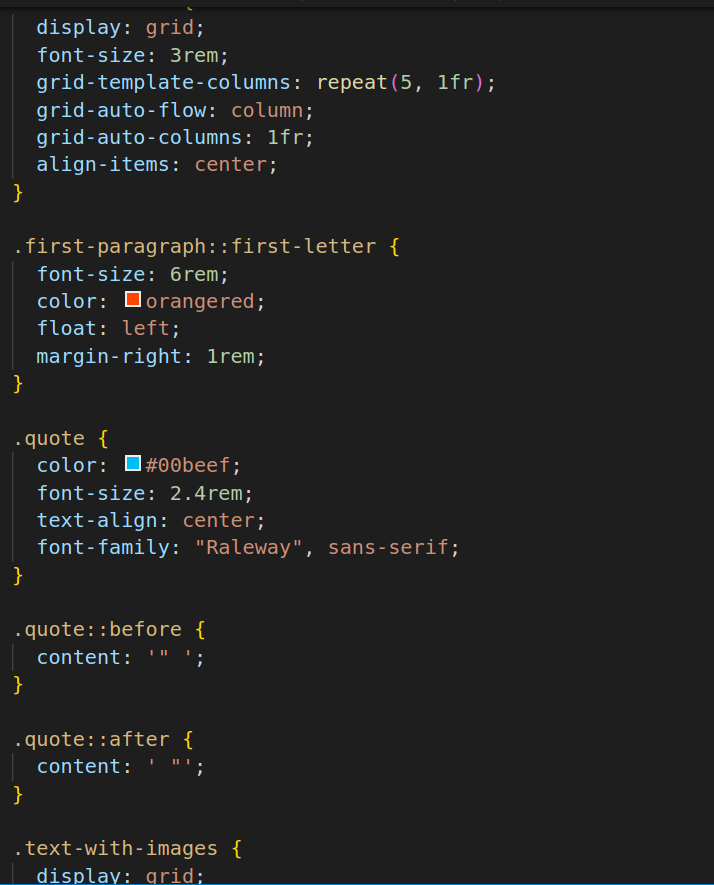

# Grid-Magzine
1.
2.
* link Elements:These link elements are used to include external CSS files in the HTML document.
* The first link element includes fonts from Google Fonts for the "Anton," "Baskerville," and "Raleway" typefaces.
* The second link element includes the Font Awesome icon library for additional icons.
* The third link element links to the local CSS file named "style.css" that likely contains custom styles for the webpage.
* main Element:The main element represents the main content of the webpage. It encloses the primary sections of the page.
* section Elements:There are two section elements used with the class "heading" and "text." These are used to structure and group content within the main part of the page.
* header Element:The header element is used to define a header section within the "heading" section.
* It typically contains introductory content, such as the page title and a brief description.
* img Element:The img element is used to embed images in the webpage.
It displays the freeCodeCamp logo and other images within the header section.
The "loading" attribute with a value of "lazy" indicates that the images should load lazily for improved performance.
* h1, p Elements:These elements are used to define headings and paragraphs of text within the header section.
h1 represents the main title ("OUR NEW CURRICULUM").
* p elements contain subtitles and other textual content.
* a Element:The a element is used to create hyperlinks.
* It links to the freeCodeCamp website with the "By freeCodeCamp" attribution.
div Elements:
* The div elements with the classes "author" and "social-icons" are used for structuring content within the "heading" section.
They group and style the author information and social media icons, respectively.
* p Element:The p element is used to display the publication date below the author information.

3.
4.

* blockquote Element The blockquote element is used to define a block of quoted text.
* It contains a p element with a class "quote" to display a quoted statement.
* hr elements are used to create horizontal lines before and after the quote.
* article and aside Elements:
These elements are used within the "text-with-images" section to structure content.
* article represents the main content, such as a brief history of the curriculum.
* aside represents supplementary content, including images and a quote.
* h3, ul, li Elements:
These elements are used for headings, lists, and list items within the "A Brief History" section.
* h3 represents a subheading ("A Brief History").
* ul represents an unordered list.
* li represents list items.
* hr Element:hr elements are used throughout the document to create horizontal lines for visual separation.

5.

6.

* The * selector selects all elements on the page, while ::before and ::after represent pseudo-elements.
* padding: 0; and margin: 0; remove default padding and margin from all elements.
* box-sizing: border-box; ensures that padding and borders are included in the element's total width and height.
* Sets the base font size for the HTML element to 62.5% of the browser's default font size. This is often done to make it easier to use rem units for font sizing.
* body:sets the font family for the entire page to 'Baskerville' and the text color to 'linen'.
Sets the background color to an RGB value (dark blueish-gray).
* h1:Sets the font family for all h1 elements to 'Anton' and specifies a fallback sans-serif font.
* Sets the font family for h2, h3, h4, h5, and h6 elements to 'Raleway' with a fallback to sans-serif.
* Removes the underline from links (text-decoration: none;) and sets the link color to 'linen'.
* Turns the main element into a grid container with three columns.
* The first and third columns have a minimum width of 2rem and can expand to take up available space (minmax(2rem, 1fr)).
* The middle column has a minimum width based on its content and a maximum width of 94rem (minmax(min-content, 94rem)).
* Sets a vertical gap of 3rem between grid items.
* Makes all img elements responsive by setting their width to 100% of their container.
* Uses object-fit: cover; to ensure the image covers the entire container without distortion.
* Adds a 1.5rem margin above and below horizontal lines (hr elements).
Sets the border of the horizontal line to be a solid line with a slightly transparent gray color.
* Targets elements with the class "heading."
* Places these elements in the second column of the grid.
* Sets up an inner grid with two equal-width columns (grid-template-columns: repeat(2, 1fr)) and a vertical gap of 1.5rem between rows.
* Targets elements with the class "text".Places these elements in the second column of the grid.
Sets the font size to 1.8rem, adds letter spacing, and defines a maximum column width of 25rem.
Justifies the text content.

7.

8.

* Targets elements with the class "hero" Spans the entire grid from the first to the last column (grid-column: 1 / -1;).
* Sets a relative position for this element.
* Targets elements with the class "hero-title."
* Centers the text horizontally (text-align: center;).
* Sets the text color to "orangered" and increases the font size to 8rem.
* Targets elements with the class "hero-subtitle."
* Sets the font size to 2.4rem, text color to "orangered," and centers the text horizontally.
* Targets elements with the class "author."
* Sets the font size to 2rem and specifies the font family as "Raleway" with a fallback to sans-serif.
* Targets anchor (a) elements within the class "author-name" when hovered.
Changes the background color to a greenish shade (#306203) when hovered.
css
* Targets elements with the class "publish-date."
Sets the text color to a semi-transparent white color.
* Targets elements with the class "social-icons."
Turns this element into a grid container with five equal-width columns (grid-template-columns: repeat(5, 1fr)).
Places grid items in a single column (grid-auto-flow: column) and sets their width to be equal (grid-auto-columns: 1fr).
Aligns the items vertically in the center (align-items: center).
* Selects the first letter of elements with the class "first-paragraph."
Increases the font size to 6rem, changes the color to "orangered," and floats it to the left with a 1rem right margin.
* Targets elements with the class "quote."
Sets the text color to a shade of blue (#00beef), font size to 2.4rem, and centers the text horizontally.
Specifies the font family as "Raleway" with a fallback to sans-serif.
* Uses pseudo-elements ::before and ::after to insert double quotation marks before and after the content within elements with the class "quote."

9.

10.

* Targets elements with the class "text-with-images."
Turns this element into a grid container with two columns: the first column occupies one fraction of available space (1fr), and the second column occupies two fractions (2fr).
Sets a gap of 3rem between columns.
Adds a margin at the bottom of the element for spacing.
* Targets elements with the class "lists."
Removes the default list-style type (bullet points or numbers) from lists within this element.
Adds a margin at the top of lists for spacing.
* Targets li elements within elements with the class "lists."
Adds a margin at the bottom of each list item for vertical spacing.
* Targets elements with the class "list-title" and "list-subtitle."
Sets the text color to a shade of blue (#00beef) for both these classes.
* Targets elements with the class "image-wrapper."
* Turns this element into a grid container with two columns (2fr and 1fr) and three rows with a minimum content height.
* Sets a 2rem gap between grid items and centers them vertically and horizontally using place-items: center;.
* Targets elements with the classes "image-1" and "image-3."
* Spans these elements across both columns within the grid.
* media queries that adjust the styling for different screen sizes:
For screens up to 720px wide, the grid layout in .image-wrapper changes to a single column.
* For screens up to 600px wide, the grid layout in .text-with-images changes to a single column.
* For screens up to 550px wide, various font sizes and other styles are adjusted to be more suitable for smaller screens.
For screens up to 420px wide, the font size of .hero-title is further reduced to accommodate very small screens.
* This media query targets screens with a maximum width of 720px.
Within this query, it adjusts the grid layout of elements with the class "image-wrapper" to a single column, effectively stacking the images on top of each other for smaller scree
* This media query targets screens with a maximum width of 600px.
Within this query, it adjusts the grid layout of elements with the class "text-with-images" to a single column, making the text and images stack vertically on smaller screens.
* This media query targets screens with a maximum width of 550px.
Within this query, it adjusts various font sizes for elements to make the content more readable on smaller screens.
It reduces the font size of the "hero-title" to 6rem and adjusts other text elements like "hero-subtitle," "author," "quote," "list-title," and "text" to 1.8rem, 2rem, and 1.6rem, respectively.
It also reduces the font size of the "social-icons" to 2rem.

# Hosted Link
https://nikhitha5511.github.io/Magzine/?authuser=0
